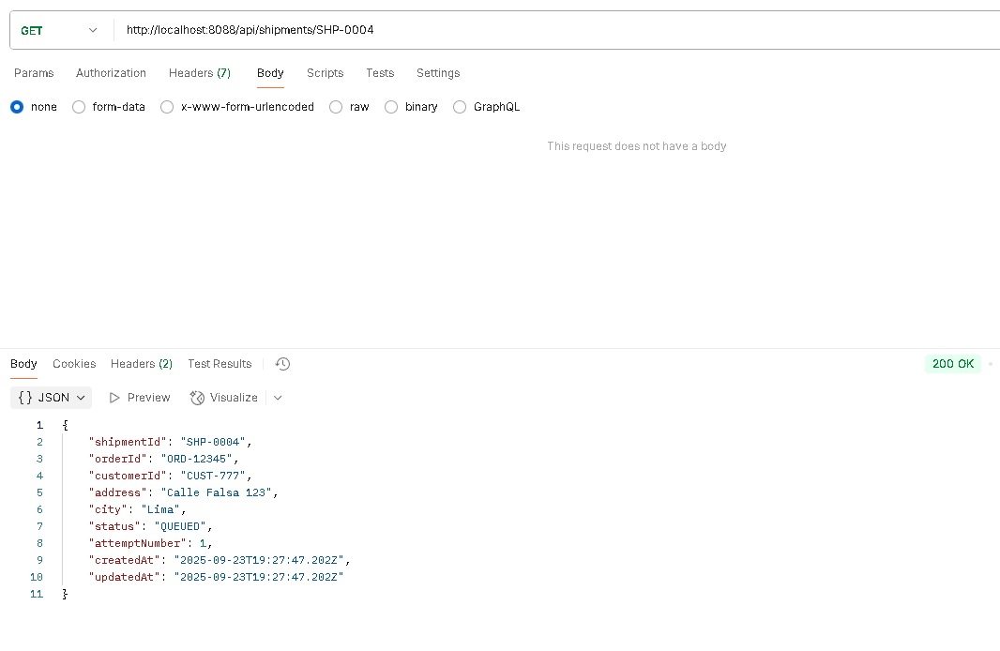

# Orquestación de Envíos con Kafka, Redis y MongoDB

Este proyecto implementa un flujo de orquestación de envíos basado en eventos (EDA) utilizando Spring Boot, Kafka, Redis y MongoDB. La solución consta de dos microservicios: un productor que publica eventos y un consumidor que procesa la lógica de negocio y persiste los datos.

## Cómo Levantar el Proyecto


1.  **Clonar los repositorios:**
    -   productor:[https://github.com/CindyMendoza/shipping-ops-producer.git](https://github.com/CindyMendoza/shipping-ops-producer.git)
        
    -   consumidor:
        [https://github.com/CindyMendoza/dispatch-orchestrator-consumer.git](https://github.com/CindyMendoza/dispatch-orchestrator-consumer.git)
        
    -   docker-compose:
        [https://github.com/CindyMendoza/proyecto-entregas-express-orquestacion/blob/main/docker-compose.yml](https://github.com/CindyMendoza/proyecto-entregas-express-orquestacion/blob/main/docker-compose.yml)
        

2.  **Compilar y construir las imágenes de Docker:**
    Compila las aplicaciones y construye las imágenes de Docker para ambos microservicios con el siguiente comando.
    ```bash
    docker-compose build
    ```

3.  **Iniciar todos los servicios:**
    Inicia la arquitectura completa desde el docker-compose.yaml
    ```bash
    docker-compose up
    ```

## Endpoints de Prueba

 **1. Envia un Nuevo Evento de Envío (Primer Intento)**

Endpoint del microservicio `shipping-ops-producer` inicia el flujo.
- **URL:** `POST http://localhost:8087/api/shipments`
- **Body (JSON):**

    ```json
    {
    "shipmentId": "SHP-0001",
    "orderId": "ORD-12345",
    "customerId": "CUST-777",
    "address": "Calle Falsa 123",
    "city": "Lima",
    "postalCode": "15000",
    "serviceLevel": "EXPRESS",
    "requestedAt": "2025-09-23T10:30:00Z",
    "attemptNumber": 1,
    "correlationId": "corr-XYZ-123",
    "status": "NEW" 
    }
    ```

- **Respuesta:**
  Recibirás una respuesta `202 Accepted`.

**2. Envia un Segundo Intento (Recuperar de Redis)**

- **URL:** `POST http://localhost:8087/api/shipments`
- **Body (JSON):**
    Cambia el `attemptNumber` a `2` y `status` a `RETRY`.

    ```json
    {
    "shipmentId": "SHP-0001",
    "orderId": "ORD-12345",
    "customerId": "CUST-777",
    "address": "Calle Falsa 123",
    "city": "Lima",
    "postalCode": "15000",
    "serviceLevel": "EXPRESS",
    "requestedAt": "2025-09-23T10:30:00Z",
    "attemptNumber": 2,
    "correlationId": "corr-XYZ-123",
    "status": "RETRY" 
    }
    ```

- **Respuesta:**
  Recibirás una respuesta `202 Accepted` .

**3. Consultar el Estado de un Envío**

El microservicio `dispatch-orchestrator-consumer` 
- **URL:** `GET http://localhost:8088/api/shipments/{shipmentId}`
- **Ejemplo:**
    - `GET http://localhost:8088/api/shipments/SHP-0001`

**Respuesta Exitosa (Primer Intento):**
```json
{
  "shipmentId": "SHP-0001",
  "orderId": "ORD-12345",
  "customerId": "CUST-777",
  "address": "Calle Falsa 123",
  "city": "Lima",
  "status": "QUEUED",
  "attemptNumber": 1,
  "createdAt": "2025-11-10T10:30:00Z",
  "updatedAt": "2025-11-10T10:35:00Z"
}
```

**Respuesta Exitosa (Segundo Intento):**
```json
{
  "shipmentId": "SHP-0001",
  "orderId": "ORD-12345",
  "customerId": "CUST-777",
  "address": "Calle Falsa 123",
  "city": "Lima",
  "status": "QUEUED_CACHE",
  "attemptNumber": 2,
  "createdAt": "2025-11-10T10:30:00Z",
  "updatedAt": "2025-11-10T10:35:00Z"
}
```
## Evidencias del Flujo en postman


